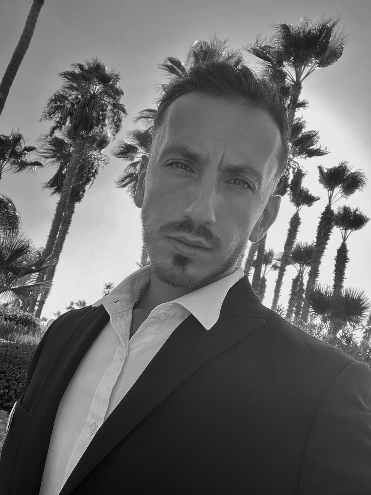

  

# Velissarios — Personal Portfolio  
*Hospitality Professional | Future AI Learner | Creative | Driven for Growth*

---

## 👋 About Me  
My name is **Velissarios**, and I’m a hospitality professional based in Limassol.  
I’m focused on **personal growth**, **financial freedom**, and learning **AI**, **investing**, and **long-term wealth building**.

I like to challenge myself, improve daily, and move toward a better version of who I can become.

---

## 🚀 What I’m Working On  
- Building a strong **portfolio** and online presence  
- Learning the fundamentals of **AI** and automation  
- Improving my **grooming**, **fitness**, and personal brand  
- Preparing to start the **gym in March 2025**  
- Exploring **singing** and creativity  

---

## 🎓 Education & Certifications  
- **IEK AKMI Graduate**  
- **Vellum Cambridge Certification**  
- Professional experience in **hospitality and customer service**

---

## 💼 Skills & Interests  
- Hospitality & customer experience  
- Fitness & self-improvement  
- AI, automation & long-term career growth  
- Creative writing (lyrics, drill/Latin flow)  
- Problem-solving & discipline  

---

## 🌟 Vision & Goals  
My long-term goal is to become **financially independent**, improve my lifestyle, and build multiple skillsets — from hospitality to AI and personal branding.

This repository is the foundation of that journey.

---

## 📫 Contact  
Coming soon (LinkedIn, website, portfolio pages).
